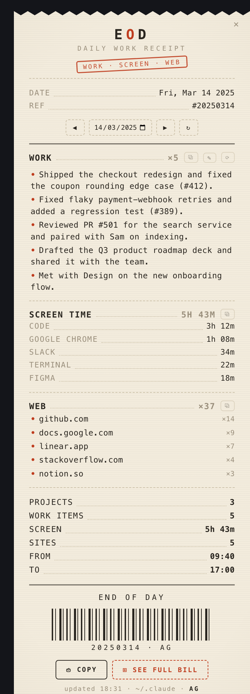
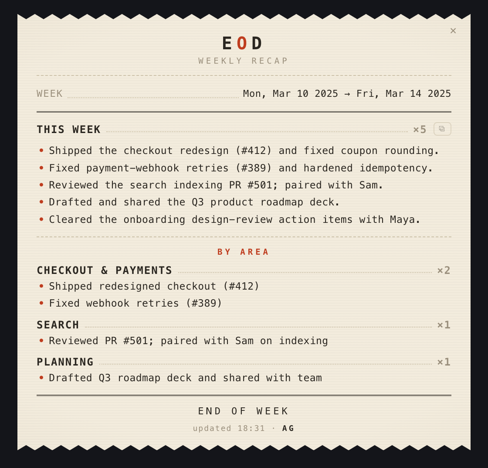

# EOD

> Your day in Claude Code, printed as a receipt.


A tiny macOS desktop widget, styled as a **printed receipt**, that shows
**everything you did in Claude Code that day** — grouped by project and
copy-paste ready for a standup, timesheet, or task sheet. It rebuilds itself
from your session transcripts in `~/.claude/projects`. Local-first, no API keys
(see [Requirements & permissions](#requirements--permissions)).

<p align="center">
  
  &nbsp;&nbsp;
  
</p>

<p align="center"><sub><b>Daily receipt</b> &nbsp;·&nbsp; <b>Weekly recap</b> &nbsp;—&nbsp; sample data; EOD builds these from your own activity, on your Mac.</sub></p>

Each line is the **work** done — Claude Code's own AI-generated session title, a
clean one-liner. No raw prompts.

<details>
<summary>Prefer text? Here's what the receipt looks like.</summary>

```
        ✂ ‾‾‾‾‾‾‾‾‾‾‾‾‾‾‾‾‾‾
                 E O D
            DAILY WORK RECEIPT
        ────────────────────────
        DATE ......... Wed, Jun 24 2026
        ◀ PREV  NEXT ▶  ↻
        ════════════════════════
        EOD ................. ×2
          • Build the daily EOD widget       09:12
          • Add the print/roll animation     15:30
        GIT-CITY ............ ×1
          • Repo → 3D city skyline           11:55
        ────────────────────────
        PROJECTS ............ 2
        WORK ITEMS .......... 3
        ════════════════════════
             *** END OF DAY ***
            ▌▏▌▎▌▌▏▎▌▏▌▎▌
              [ ⎙ COPY ALL ]
        ✂ ____________________
```

</details>

## Features

- **Auto-built daily** from `~/.claude` — rolls over at midnight, refreshes through the day.
- **Daily receipt + weekly recap** — one keystroke from the menu bar.
- **Copy all** or per-project **copy**, straight to the clipboard.
- **◀ ▶ browse previous days** for back-filling a sheet.
- **Frameless + transparent** — only the cream paper shows on your wallpaper; drag it by the masthead. Floats over full-screen apps.
- **Prints down** when opened, **rolls up** when closed.
- **Hide private projects** via an `exclude.txt` file (NDA / job-hunt work).

## Requirements & permissions

Three things, all free and most likely already on your Mac:

| Integrate | Why | Permission to grant |
|---|---|---|
| **Claude Code** | EOD reads your local transcripts in `~/.claude/projects` to build the receipt. | None — it only **reads** files already on your Mac. |
| **[Hammerspoon](https://www.hammerspoon.org/)** | The free automation app that hosts and draws the widget. | **Accessibility** — System Settings → Privacy & Security → Accessibility → enable Hammerspoon (for dragging + the hotkey). |
| **`python3`** | Runs `extract.py`, the parser behind the receipt. Check with `python3 --version`. | None. Looked up in `/opt/homebrew/bin`, `/usr/local/bin`, `/usr/bin`. |

**Local-first, no API keys, no telemetry.** EOD reads local files and writes a
receipt to its own `cache/` folder. The one exception is the **optional AI-polish**
step: if your `claude` CLI is logged in, EOD asks it to rewrite the day into
crisper, manager-ready bullets — that goes through your **existing CLI login**
(no API key). Missing CLI? It silently falls back to fully-offline cleanup.

## Install

~3 minutes. Full guide in **[INSTALL.md](INSTALL.md)** — short version:

```sh
# don't already use Hammerspoon? drop EOD straight into its config:
mkdir -p ~/.hammerspoon && cp -R ./* ~/.hammerspoon/
```

Then open Hammerspoon → **Reload Config** (⌥⌃⌘R). The receipt prints down in the
top-right. (Already have an `init.lua`? Don't overwrite it — see INSTALL.md.)

## Controls

| Action | How |
|---|---|
| Show / hide | menu-bar **▤**, or **⌥⌃⌘W** |
| Hide | the **✕** on the receipt |
| Move it | drag the **EOD** masthead |
| Copy the day | **⎙ Copy all** |
| Copy one project | the **⧉** on that project |
| Previous / next day | **◀ ▶** |
| Refresh | **↻** |

## How it works

- **`extract.py`** parses every `*.jsonl` transcript for the target day, takes each
  session's AI title, de-dupes per project, filters noise, and writes a
  self-contained receipt HTML to `cache/`.
- **`eod.lua`** is a Hammerspoon module that renders that HTML in a frameless
  `hs.webview`, runs the engine on a timer, and handles copy / nav / drag / animation.

---

MIT licensed.
