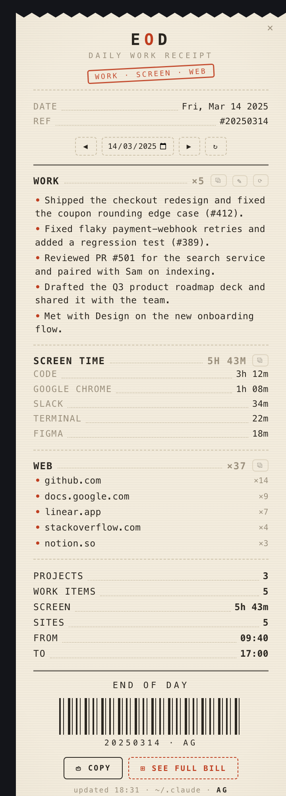

# EOD

> Your whole work day, printed as a receipt.


**[eodreceipt.vercel.app](https://eodreceipt.vercel.app)** — what it looks like, what it reads, and how to install it.

A tiny macOS desktop widget, styled as a **printed receipt**, that shows
**everything you got done that day** — your AI coding sessions, the sites and
docs you worked in, the commits you shipped — grouped and copy-paste ready for a
standup, timesheet, or task sheet. It rebuilds itself from files already on your
Mac. Local-first, no API keys (see [Requirements & permissions](#requirements--permissions)).

### Where it pulls from

| Source | Shows up as | Read from |
|---|---|---|
| **Claude Code** + **Codex** | **WORK** — your coding sessions, per project | their local JSONL transcripts |
| **Git** | shipped commits & PRs | repos in your work folders |
| **Documents** | decks / docs / sheets / PDFs you created or edited | your work folders |
| **Browsing** | **WEB** — the sites you spent time on | Chrome / Brave / Safari history |
| **Apps** | **SCREEN TIME** | local app-usage |

All local — nothing leaves your Mac (one optional exception, [below](#requirements--permissions)).

<p align="center">
  
  &nbsp;&nbsp;
  
</p>

<p align="center"><sub><b>Daily receipt</b> &nbsp;·&nbsp; <b>Weekly recap</b> &nbsp;—&nbsp; sample data; EOD builds these from your own activity, on your Mac.</sub></p>

Each line is the **work** done: the AI-generated session title from Claude Code
or Codex, a clean one-liner. The receipt itself never prints your raw prompts.
(The optional AI-polish step does read them; see
[Requirements & permissions](#requirements--permissions) for exactly what it sends.)

<details>
<summary>Prefer text? Here's what the receipt looks like.</summary>

```
        ✂ ‾‾‾‾‾‾‾‾‾‾‾‾‾‾‾‾‾‾
                 E O D
            DAILY WORK RECEIPT
        ────────────────────────
        DATE ......... Wed, Jun 24 2026
        ◀ PREV  NEXT ▶  ↻
        ════════════════════════
        EOD ................. ×2
          • Build the daily EOD widget       09:12
          • Add the print/roll animation     15:30
        GIT-CITY ............ ×1
          • Repo → 3D city skyline           11:55
        ────────────────────────
        PROJECTS ............ 2
        WORK ITEMS .......... 3
        ════════════════════════
             *** END OF DAY ***
            ▌▏▌▎▌▌▏▎▌▏▌▎▌
              [ ⎙ COPY ALL ]
        ✂ ____________________
```

</details>

## Features

- **Auto-built daily** from your local activity — rolls over at midnight, refreshes through the day.
- **Multi-source** — Claude Code + Codex sessions, git commits, documents, browsing, and screen time on one receipt.
- **Daily receipt + weekly recap** — one keystroke from the menu bar.
- **Copy all** or per-project **copy**, straight to the clipboard.
- **Edit inline** — fix a line, **＋ add** one, or **✕ delete** one before you copy. On the **weekly recap** your hand-edits stick and survive a re-summarize (unless you force one with **⟳**).
- **◀ ▶ browse previous days** for back-filling a sheet.
- **Frameless + transparent** — only the cream paper shows on your wallpaper; drag it by the masthead. Floats over full-screen apps.
- **Prints down** when opened, **rolls up** when closed.
- **Hide private projects** via an `exclude.txt` file (NDA / job-hunt work).

## Requirements & permissions

The two required pieces are free and most likely already on your Mac. The rest
just determines what shows up on the receipt:

| Integrate | Why | Permission to grant |
|---|---|---|
| **[Hammerspoon](https://www.hammerspoon.org/)** (required) | The free automation app that hosts and draws the widget. | **Accessibility** — System Settings → Privacy & Security → Accessibility → enable Hammerspoon (for dragging + the hotkey). |
| **`python3`** (required) | Runs `extract.py`, the parser behind the receipt. Check with `python3 --version`. | None. Looked up in `/opt/homebrew/bin`, `/usr/local/bin`, `/usr/bin`. |
| **Claude Code** / **Codex** | EOD reads their local JSONL transcripts (`~/.claude/projects`, `~/.codex`) for the WORK section. Use at least one. | None — it only **reads** files already on your Mac. |
| Browser history | Powers the WEB section (Chrome / Brave automatic). | Safari history may need **Full Disk Access** for the Hammerspoon process. |

**Local-first, no API keys, no telemetry.** EOD reads local files and writes a
receipt to its own `cache/` folder. The one exception is the **optional AI-polish**
step: if your `claude` CLI is logged in, EOD asks it to rewrite the day into
crisper, manager-ready bullets, through your **existing CLI login** (no API key).
Missing CLI? It falls back to fully-offline cleanup.

<details>
<summary><b>Exactly what that one step sends, so you can decide for yourself.</b></summary>

Nothing else in EOD leaves your Mac. When AI-polish runs, it sends:

| Sent | Not sent |
|---|---|
| Session titles | Anything from a project in `exclude.txt` |
| Up to 8 prompts per session, 160 chars each | Personal browsing (job boards, shopping, social) |
| Commit subjects and PR titles | Mail, chat and calendar hosts |
| Meeting titles | Names of the people you met or collaborated with |
| Document filenames and their folder | File contents, ever |
| Page titles from work browsing | Screen-time app data |

Two things worth knowing. Your prompts do go, and prompts sometimes contain
paths, hostnames or pasted snippets. And this is your own Claude account via
your own CLI login, not a third party.

See it for yourself before trusting any of the above:

```sh
python3 extract.py --show-polish-payload      # prints the exact text, sends nothing
touch polish.off                              # never run this step again
```

</details>

## Configuration

Four optional files, all sitting next to `extract.py`. None of them exist by
default; create one only if you want the behaviour.

| File | What it does |
|---|---|
| **`exclude.txt`** | One project name per line. Those projects never reach the receipt. For client, NDA or job-hunt work. Copy `exclude.txt.example` to start. |
| **`repos.txt`** | One repo path per line. Adds repos that live outside the folders scanned by default (`~/Desktop`, `~/Documents`, `~/code`, `~/dev`, `~/projects`, `~/work`, `~/repos`). Lines starting with `#` are ignored. |
| **`polish.off`** | Create this empty file to switch the optional AI-polish step off completely. EOD then never shells out to the `claude` CLI and stays fully offline. The file's contents are ignored; only its presence matters. |
| **`signature.txt`** | The small mark at the foot of the receipt. Defaults to the initials of your `git config --global user.name`. Put anything you like in here to override it, or leave the file empty to print no mark at all. |

```sh
cp exclude.txt.example exclude.txt   # then edit
echo ~/src/some-repo > repos.txt     # extra git repo outside the default roots
touch polish.off                     # fully offline, no claude CLI call ever
printf 'AG' > signature.txt          # override the footer mark (empty file = none)
```

## Install

~3 minutes. Full guide in **[INSTALL.md](INSTALL.md)** — short version:

```sh
# don't already use Hammerspoon? drop EOD straight into its config:
mkdir -p ~/.hammerspoon && cp -R ./* ~/.hammerspoon/
```

Then open Hammerspoon → **Reload Config** (⌥⌃⌘R). The receipt prints down in the
top-right. (Already have an `init.lua`? Don't overwrite it — see INSTALL.md.)

## Controls

| Action | How |
|---|---|
| Show / hide | menu-bar **▤**, or **⌥⌃⌘W** |
| Hide | the **✕** on the receipt |
| Move it | drag the **EOD** masthead |
| Copy the day | **⎙ Copy all** |
| Copy one project | the **⧉** on that project |
| Edit lines | **✎** on the WORK / weekly header — then **💾** to save |
| Add a line | **＋** on the WORK / weekly header |
| Delete a line | the **✕** beside a line (while editing) |
| Re-summarize | **⟳** (on the weekly recap this re-polishes, discarding hand-edits) |
| Previous / next day | **◀ ▶** |
| Refresh | **↻** |

## How it works

- **`extract.py`** parses every Claude Code and Codex `*.jsonl` transcript for the
  target day, takes each session's AI title, de-dupes per project, folds in git
  commits / documents / browser history / app usage, filters noise, and writes a
  self-contained receipt HTML to `cache/`.
- **`eod.lua`** is a Hammerspoon module that renders that HTML in a frameless
  `hs.webview`, runs the engine on a timer, and handles copy / nav / drag / animation.

## Command line

The receipt without the widget, for piping into a standup bot, a timesheet or a
cron job.

```sh
bin/eod today              # today's receipt as text
bin/eod today --md         # markdown, for a PR description or doc
bin/eod today --json       # the whole day
bin/eod day 2026-08-01     # any past day
bin/eod week               # the weekly recap
bin/eod sources            # what is set up on this machine, and what is not
bin/eod payload            # what AI-polish would send, without sending it
```

`--raw` skips the AI-polish step even when it is configured.

## Adding a source

Sources are discovered, not hardcoded, so adding Linear, Jira, Toggl or anything
else means writing one file. Drop it in `~/.eod/sources/` and it is picked up:
no fork, no edit to this repo.

```python
# ~/.eod/sources/linear.py
from eod.sources.base import Source, register

class LinearSource(Source):
    name    = "linear"
    section = "SHIPPED"          # where it shows: WORK, SHIPPED, WEB, SCREEN, DOCS, MEETINGS
    key     = "linear_issues"    # which field of the day it fills
    summary = "Issues you moved today"
    requires = "a LINEAR_API_KEY"

    def available(self):
        """Is this set up? Must never raise. False means stay quiet."""
        return bool(os.environ.get("LINEAR_API_KEY"))

    def read(self, date):
        """Items for the local day. Raise on real failure; the caller reports it."""
        return [{"id": "ENG-1", "title": "closed the flaky test"}]

register(LinearSource())
```

The split between `available()` and `read()` is the whole point. A source that
is not configured says nothing. A source that **is** configured and then fails is
reported on the receipt, because those two used to look identical from the
outside, and that is how a broken section can sit there for days looking like a
quiet one.

Items under a `key` the renderers do not know are kept in `data["extra"]` rather
than dropped. A plugin that blows up on import is reported and skipped: a
third-party file cannot stop your receipt building.

## Tests

No dependencies, same as the tool. Stdlib `unittest`, fixtures written to a temp
directory so the suite never reads or disturbs your real `~/.claude`.

```sh
./run_tests.sh              # everything
./run_tests.sh -v           # one line per test
./run_tests.sh test_dates   # a single module
```

The suite runs on 3.9 and 3.12 in CI, plus a `luac -p` check on `eod.lua`. It is
run with `-W error::ResourceWarning`, so a leaked file handle fails the build:
the transcript readers leaked one per file before these tests existed.

Two guards worth knowing about, because they are about intent rather than
correctness. CI fails if any of the four config files stops being read by
`extract.py` or disappears from this README, and it fails if the hardcoded author
signature or its self-restoring guard ever come back.

---

MIT licensed. Built by [@avinashgaurav](https://github.com/avinashgaurav).
